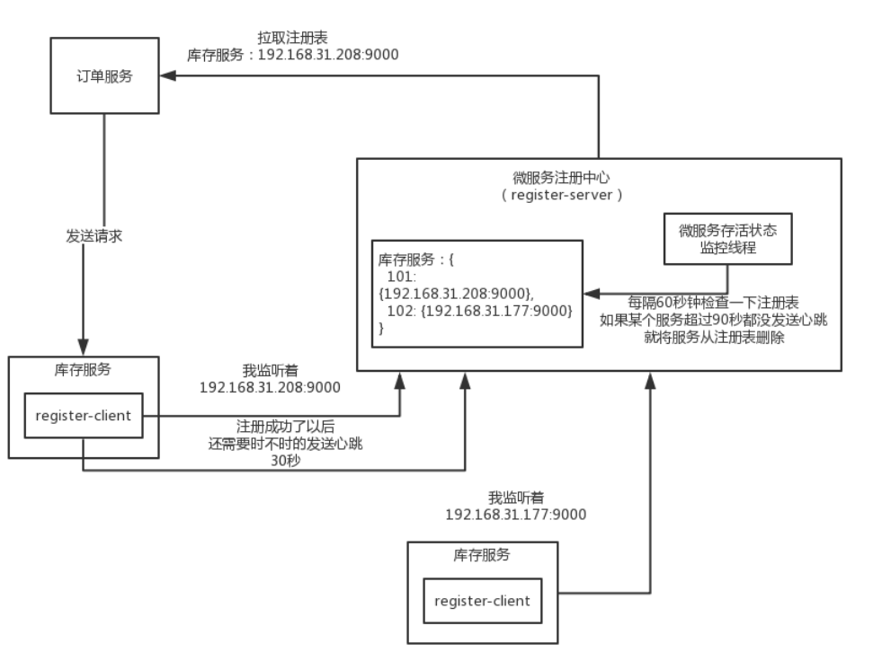

# 项目背景与初始化

> 基本功：集合、并发、io、网络

# 1、微服务注册中心案例背景



# 2、模拟注册

### 2.1 register-client

> 一个组件，是一个依赖包，用来和register-server通信，完成服务注册、心跳检测等功能


#### 2.1.1 注册请求

```java
@Data
@Builder
@AllArgsConstructor
@NoArgsConstructor
public class RegisterRequest {
    /**
     * 服务名称
     */
    private String serviceName;
    
    /**
     * 服务所在机器的ip地址
     */
    private String ip;
   
    /**
     * 服务所在机器的主机名
     */
    private String hostname;
    
    /**
     * 服务监听着哪个端口号
     */
    private int port;
    
    /**
     * 服务实例
     */
    private String serviceInstanceId;
}
```


#### 2.1.2 注册响应

```java
@Data
@NoArgsConstructor
public class RegisterResponse {
    /**
     * 响应成功
     */
    public static final String SUCCESS = "success";

    /**
     * 响应失败
     */
    public static final String FAILURE = "failure";

    /**
     * 注册响应状态：SUCCESS、FAILURE
     */
    private String status;
}
```

#### 2.1.3  发送http请求的组件

```java
/**
 * 负责发送各种Http请求的组件
 */
@Data
@NoArgsConstructor
public class HttpSender {
    
    private RegisterRequest registerRequest;
    
   /**
    * 发送注册请求
    * @param registerRequest
    * @return
    */
    public RegisterResponse register(RegisterRequest registerRequest) {
        System.out.println("服务实例【" + registerRequest.getServiceInstanceId() + "】，发送请求进行注册......");
        RegisterResponse registerResponse = new RegisterResponse();
        registerResponse.setStatus(RegisterResponse.SUCCESS);
        return registerResponse;
    }
}
```

#### 2.1.4  客户端

```java
public class RegisterClient {

    /**
     * 服务实例id
     */
    private String serviceInstanceId;

    public void setServiceInstanceId() {
        this.serviceInstanceId = UUID.randomUUID().toString().replace("-", "");
    }

    public void start() {
        new RegisterClientWorker(serviceInstanceId).start();
    }

    /**
     * 负责向register-server发起注册申请的线程
     */
    private class RegisterClientWorker extends Thread {

        /**
         * 服务名
         */
        public static final String SERVICE_NAME = "inventory-service";

        /**
         * 服务ip
         */
        public static final String IP = "192.168.31.207";

        /**
         * 主机名
         */
        public static final String HOSTNAME = "inventory01";

        /**
         * 端口
         */
        public static final int PORT = 9000;

        /**
         *  http通信组件
         */
        private HttpSender httpSender;

        /**
         * 服务实例id
         */
        private String serviceInstanceId;

        /**
         * 是否完成服务注册
         */
        private Boolean finishedRegister;    

        public RegisterClientWorker(String serviceInstanceId) {
            this.httpSender = new HttpSender();
            this.serviceInstanceId = serviceInstanceId;
        }

        @Override
        public void run() {
            RegisterRequest registerRequest
                    = RegisterRequest.builder()
                    .serviceName(SERVICE_NAME)
                    .port(PORT)
                    .ip(IP)
                    .hostname(HOSTNAME)
                    .serviceInstanceId(serviceInstanceId).build();

            //  开始注册
            if (!finishedRegister) {
                RegisterResponse registerResponse = httpSender.register(registerRequest);
                System.out.println("服务注册的结果是：" + registerResponse.getStatus() + "......");

                if (registerResponse.getStatus() != RegisterResponse.SUCCESS) {
                    return;
                }

                finishedRegister = true;
            }      
        }
    }
}
```


### 2.2  register-server

> 以web工程进行独立部署和启动的服务，作用是监听各个服务发送过来的http请求（注册、心跳、下线等）

#### 2.2.1 注册请求

```java
@Data
@Builder
@AllArgsConstructor
@NoArgsConstructor
public class RegisterRequest {
    /**
     * 服务名称
     */
    private String serviceName;
    
    /**
     * 服务所在机器的ip地址
     */
    private String ip;
   
    /**
     * 服务所在机器的主机名
     */
    private String hostname;
    
    /**
     * 服务监听着哪个端口号
     */
    private int port;
    
    /**
     * 服务实例
     */
    private String serviceInstanceId;
}
```


#### 2.2.2 注册响应

```java
@Data
@NoArgsConstructor
public class RegisterResponse {
    /**
     * 响应成功
     */
    public static final String SUCCESS = "success";

    /**
     * 响应失败
     */
    public static final String FAILURE = "failure";

    /**
     * 注册响应状态：SUCCESS、FAILURE
     */
    private String status;
}
```

#### 2.2.3 注册表

```java
public class Registry {

    /**
     * <服务名称，<服务实例id, 服务实例信息>>
     */
    private Map<String, Map<String, ServiceInstance>> registry = new HashMap<>();

    /**
     * 注册表是单例
     */
    private static Registry instance = new Registry();

    private Registry() {
    }

    public static Registry getInstance() {
        return instance;
    }

    /**
     * 服务注册
     * @param serviceInstance 服务实例
     */
    public void register(ServiceInstance serviceInstance) {
        Map<String, ServiceInstance> serviceInstanceMap = registry.get(serviceInstance.getServiceName());
        if (serviceInstanceMap == null) {
            serviceInstanceMap = new HashMap<>();
            serviceInstanceMap.put(serviceInstance.getServiceInstanceId(), serviceInstance);
            registry.put(serviceInstance.getServiceName(), serviceInstanceMap);
        }

        serviceInstanceMap.put(serviceInstance.getServiceInstanceId(), serviceInstance);

        System.out.println("服务实例【" + serviceInstance + "】，完成注册......");
        System.out.println("注册表：" + registry);
    }

    /**
     * 获取服务
     * @param serviceName        服务名称
     * @param serviceInstanceId  服务实例id
     * @return
     */
    public ServiceInstance get(String serviceName, String serviceInstanceId) {
        if (StringUtils.isNoneBlank(serviceName)) {
            Map<String, ServiceInstance> serviceInstanceMap = registry.get(serviceName);
            if (serviceInstanceMap != null) {
                return serviceInstanceMap.get(serviceInstanceId);
            }
        }

        return null;
    }

    /**
     * 获取整个注册表
     * @return
     */
    public Map<String, Map<String, ServiceInstance>> getRegistry() {
        return registry;
    }

    /**
     * 从注册表删除一个服务实例
     * @param serviceName
     * @param serviceInstanceId
     */
    public void remove(String serviceName, String serviceInstanceId) {
        if (StringUtils.isNoneBlank(serviceName)) {
            Map<String, ServiceInstance> serviceInstanceMap = registry.get(serviceName);
            if (serviceInstanceMap != null) {
                serviceInstanceMap.remove(serviceInstanceId);
                System.out.println("服务实例【" + serviceInstanceId + "】，从注册表中进行摘除");
            }
        }
    }
}
```


#### 2.2.4 服务端

```java
public class RegisterServerController {

    private Registry registry = Registry.getInstance();

    /**
     * 服务注册
     * @param registerRequest   注册请求
     * @return  注册响应
     */
    public RegisterResponse register(RegisterRequest registerRequest) {
        RegisterResponse registerResponse = new RegisterResponse();

        try {
            ServiceInstance serviceInstance = new ServiceInstance();
            serviceInstance.setServiceName(registerRequest.getServiceName());
            serviceInstance.setIp(registerRequest.getIp());
            serviceInstance.setHostname(registerRequest.getHostname());
            serviceInstance.setPort(registerRequest.getPort());
            serviceInstance.setServiceInstanceId(registerRequest.getServiceInstanceId());

            registry.register(serviceInstance);

            registerResponse.setStatus(RegisterResponse.SUCCESS);
        } catch (Exception e) {
            e.printStackTrace();
            registerResponse.setStatus(RegisterResponse.FAILURE);
        }

        return registerResponse;
    }
}
```


### 2.3  测试

#### 2.3.1  服务器端

```java
public class RegisterServerApplication {

    public static void main(String[] args) {
        RegisterServerController serverController = new RegisterServerController();

        String serviceInstanceId = UUID.randomUUID().toString().replace("-", "");
        RegisterRequest registerRequest = new RegisterRequest();
        registerRequest.setHostname("inventory-service-01");
        registerRequest.setIp("192.168.31.208");
        registerRequest.setPort(9000);
        registerRequest.setServiceInstanceId(serviceInstanceId);
        registerRequest.setServiceName("inventory-service");

        // 模拟发起一个服务注册的请求
        serverController.register(registerRequest);

        while (true) {
            try {
                Thread.sleep(100);
            } catch (InterruptedException e) {
                e.printStackTrace();
            }
        }
    }
}
```


#### 2.3.2  客户端

```java
public class RegisterClientApplication {

    public static void main(String[] args) {
        RegisterClient registerClient = new RegisterClient();
        //模拟请求注册
        registerClient.start();

        while (true) {
            try {
                Thread.sleep(100);
            } catch (InterruptedException e) {
                e.printStackTrace();
            }
        }
    }
}
```


# 3、模拟心跳

## 3.1  register-client

### 3.1.1  心跳请求

```java
@Data
@AllArgsConstructor
@NoArgsConstructor
public class HeartbeatRequest {

    /**
     * 服务实例id
     */
    private String serviceInstanceId;

    /**
     * 服务名称
     */
    private String serviceName;
}
```

### 3.1.2  心跳响应

```java
@Data
public class HeartbeatResponse {
    /**
     * 响应成功
     */
    public static final String SUCCESS = "success";

    /**
     * 响应失败
     */
    public static final String FAILURE = "failure";

    /**
     * 心跳响应状态：SUCCESS、FAILURE
     */
    private String status;
}
```

### 3.1.3  http请求组件

在`HttpSender`中加入如下代码：

```java
	/**
     * 发送心跳请求
     * @param heartbeatRequest
     * @return
     */
    public HeartbeatResponse heartbeat(HeartbeatRequest heartbeatRequest) {
        System.out.println("服务实例【" + heartbeatRequest.getServiceInstanceId() + "】，发送请求进行心跳......");
        HeartbeatResponse heartbeatResponse = new HeartbeatResponse();
        heartbeatResponse.setStatus(HeartbeatResponse.SUCCESS);
        return heartbeatResponse;
    }
```

### 3.1.4  客户端

```java
public class RegisterClient {

    /**
     * 服务实例id
     */
    private String serviceInstanceId;

    public RegisterClient() {
        this.serviceInstanceId = UUID.randomUUID().toString().replace("-", "");
    }

    public void start() {
        new RegisterClientWorker(serviceInstanceId).start();
    }

    /**
     * 负责向register-server发起注册申请的线程
     */
    private class RegisterClientWorker extends Thread {

        /**
         * 服务名
         */
        public static final String SERVICE_NAME = "inventory-service";

        /**
         * 服务ip
         */
        public static final String IP = "192.168.31.207";

        /**
         * 主机名
         */
        public static final String HOSTNAME = "inventory01";

        /**
         * 端口
         */
        public static final int PORT = 9000;

        /**
         *  http通信组件
         */
        private HttpSender httpSender;

        /**
         * 服务实例id
         */
        private String serviceInstanceId;

        /**
         * 是否完成服务注册
         */
        private boolean finishedRegister;

        /**
         * 心跳间隔
         */
        private long heartBeatInterval = 30 * 1000L;

        public RegisterClientWorker(String serviceInstanceId) {
            this.httpSender = new HttpSender();
            this.serviceInstanceId = serviceInstanceId;
        }

        @Override
        public void run() {
            RegisterRequest registerRequest
                    = RegisterRequest.builder()
                    .serviceName(SERVICE_NAME)
                    .port(PORT)
                    .ip(IP)
                    .hostname(HOSTNAME)
                    .serviceInstanceId(serviceInstanceId).build();

            //  开始注册
            if (!finishedRegister) {
                RegisterResponse registerResponse = httpSender.register(registerRequest);
                System.out.println("服务注册的结果是：" + registerResponse.getStatus() + "......");

                if (registerResponse.getStatus() != RegisterResponse.SUCCESS) {
                    return;
                }

                finishedRegister = true;
            }

            //  注册成功发送心跳
            if (finishedRegister) {
                HeartbeatRequest heartbeatRequest = new HeartbeatRequest();
                heartbeatRequest.setServiceInstanceId(serviceInstanceId);
                heartbeatRequest.setServiceName(SERVICE_NAME);

                while (true) {
                    HeartbeatResponse heartbeatResponse = httpSender.heartbeat(heartbeatRequest);
                    System.out.println("服务注册的结果是：" + heartbeatResponse.getStatus() + "......");
                    try {
                        Thread.sleep(heartBeatInterval);
                    } catch (InterruptedException e) {
                        e.printStackTrace();
                    }
                }
            }
        }
    }
}
```


## 3.2  register-server

### 3.2.1  心跳请求

```java
@Data
@AllArgsConstructor
@NoArgsConstructor
public class HeartbeatRequest {

    /**
     * 服务实例id
     */
    private String serviceInstanceId;

    /**
     * 服务名称
     */
    private String serviceName;
}
```

### 3.2.2  心跳响应

```java
@Data
public class HeartbeatResponse {
    /**
     * 响应成功
     */
    public static final String SUCCESS = "success";

    /**
     * 响应失败
     */
    public static final String FAILURE = "failure";

    /**
     * 心跳响应状态：SUCCESS、FAILURE
     */
    private String status;
}
```

### 3.2.3  服务实例

```java
@Data
public class ServiceInstance {

    /**
     * 服务名称
     */
    private String serviceName;

    /**
     * ip地址
     */
    private String ip;

    /**
     * 主机名
     */
    private String hostname;

    /**
     * 端口号
     */
    private int port;

    /**
     * 服务实例id
     */
    private String serviceInstanceId;

    /**
     * 契约
     */
    private Lease lease;

    public ServiceInstance() {
        this.lease = new Lease();
    }

    public void renew() {
        this.lease.renew();
    }

    private class Lease {

        /**
         * 最近心跳时间
         */
        private long latestHeartbeatTime;
		
        /**
		 * 续约，发送一次心跳，就相当于把register-client和register-server之间维护的一个契约
		 * 进行了续约，我还存活着，我们俩的契约可以维持着
		 */
        public void renew() {
            this.latestHeartbeatTime = System.currentTimeMillis();
            System.out.println("服务实例【" + serviceInstanceId + "】，进行续约：" + latestHeartbeatTime);
        }
    }
}
```

### 3.2.4  服务端

加入如下代码：

```java
/**
     * 心跳续约
     * @param heartbeatRequest 心跳请求
     * @return  心跳响应
     */
    public HeartbeatResponse heartbeat(HeartbeatRequest heartbeatRequest) {
        HeartbeatResponse heartbeatResponse = null;
        try {
            heartbeatResponse = new HeartbeatResponse();
            ServiceInstance serviceInstance = registry.get(heartbeatRequest.getServiceName(), heartbeatRequest.getServiceInstanceId());
            serviceInstance.renew();
            heartbeatResponse.setStatus(HeartbeatResponse.SUCCESS);
        } catch (Exception e) {
            e.printStackTrace();
            heartbeatResponse.setStatus(HeartbeatResponse.FAILURE);
        }
        return heartbeatResponse;
    }
```


## 3.3  测试

服务端

```java
public class RegisterServerApplication {

    public static void main(String[] args) {
        RegisterServerController serverController = new RegisterServerController();

        String serviceInstanceId = UUID.randomUUID().toString().replace("-", "");
        RegisterRequest registerRequest = new RegisterRequest();
        registerRequest.setHostname("inventory-service-01");
        registerRequest.setIp("192.168.31.208");
        registerRequest.setPort(9000);
        registerRequest.setServiceInstanceId(serviceInstanceId);
        registerRequest.setServiceName("inventory-service");

        // 模拟发起一个服务注册的请求
        serverController.register(registerRequest);

        //  模拟一次心跳续约
        HeartbeatRequest heartbeatRequest = new HeartbeatRequest();
        heartbeatRequest.setServiceName(registerRequest.getServiceName());
        heartbeatRequest.setServiceInstanceId(registerRequest.getServiceInstanceId());
        serverController.heartbeat(heartbeatRequest);

        while (true) {
            try {
                Thread.sleep(100);
            } catch (InterruptedException e) {
                e.printStackTrace();
            }
        }
    }
}
```


# 4、监控服务存活状态

## 4.1  监控组件

在服务器端添加微服务存活状态监控组件

```java
public class ServiceAliveMonitor {

    /**
     * 检查服务实例是否存活的间隔
     */
    private static final Long CHECK_ALIVE_INTERVAL = 60 * 1000L;

    private CheckedLife checkedLife;

    public ServiceAliveMonitor() {
        this.checkedLife = new CheckedLife();
    }

    public void start() {
        this.checkedLife.start();
    }

    private class CheckedLife extends Thread {
        private Registry registry = Registry.getInstance();

        @Override
        public void run() {
            Map<String, Map<String, ServiceInstance>> services = null;
            try {
                services = this.registry.getRegistry();
                for (String serviceName : services.keySet()) {
                    Map<String, ServiceInstance> serviceInstanceMap = services.get(serviceName);
                    for (String serviceInstance : serviceInstanceMap.keySet()) {
                        ServiceInstance instance = serviceInstanceMap.get(serviceInstance);
                        if (!instance.isAlive()) {
                            System.out.println("服务实例【"  + instance+ "】，已被移除......");
                            registry.remove(serviceName, instance.getServiceInstanceId());
                        }
                    }
                }

                Thread.sleep(CHECK_ALIVE_INTERVAL);
            } catch (Exception e) {
                e.printStackTrace();
            }
        }
    }
}
```

## 4.2  	服务实例

```java
@Data
public class ServiceInstance {

    /**
     * 判断一个服务实例不再存活的周期
     */
    private static final Long NOT_ALIVE_PERIOD = 90 * 1000L;

    /**
     * 服务名称
     */
    private String serviceName;

    /**
     * ip地址
     */
    private String ip;

    /**
     * 主机名
     */
    private String hostname;

    /**
     * 端口号
     */
    private int port;

    /**
     * 服务实例id
     */
    private String serviceInstanceId;

    /**
     * 契约
     */
    private Lease lease;

    public ServiceInstance() {
        this.lease = new Lease();
    }

    /**
     * 续约，发送一次心跳，就相当于把register-client和register-server之间维护的一个契约
     * 进行了续约，我还存活着，我们俩的契约可以维持着
     */
    public void renew() {
        this.lease.renew();
    }
	
    public boolean isAlive() {
        return this.lease.isAlive();
    }

    private class Lease {

        /**
         * 最近心跳时间
         */
        private long latestHeartbeatTime;

        public void renew() {
            this.latestHeartbeatTime = System.currentTimeMillis();
            System.out.println("服务实例【" + serviceInstanceId + "】，进行续约：" + latestHeartbeatTime);
        }

        /**
         * 监控当前服务实例是否存活
         */
        public boolean isAlive() {
            long currentTimeMillis = System.currentTimeMillis();
            if (currentTimeMillis - latestHeartbeatTime > NOT_ALIVE_PERIOD) {
                System.out.println("服务实例【" + serviceInstanceId + "】，不再存活");
                return false;
            }

            System.out.println("服务实例【" + serviceInstanceId + "】，保持存活");
            return true;
        }
    }
}

```


## 4.3  测试

```java
public class RegisterServerApplication {

    public static void main(String[] args) {
        RegisterServerController serverController = new RegisterServerController();

        String serviceInstanceId = UUID.randomUUID().toString().replace("-", "");
        RegisterRequest registerRequest = new RegisterRequest();
        registerRequest.setHostname("inventory-service-01");
        registerRequest.setIp("192.168.31.208");
        registerRequest.setPort(9000);
        registerRequest.setServiceInstanceId(serviceInstanceId);
        registerRequest.setServiceName("inventory-service");

        // 模拟发起一个服务注册的请求
        serverController.register(registerRequest);

        //  模拟一次心跳续约
        HeartbeatRequest heartbeatRequest = new HeartbeatRequest();
        heartbeatRequest.setServiceName(registerRequest.getServiceName());
        heartbeatRequest.setServiceInstanceId(registerRequest.getServiceInstanceId());
        serverController.heartbeat(heartbeatRequest);

        ServiceAliveMonitor serviceAliveMonitor = new ServiceAliveMonitor();
        serviceAliveMonitor.start();

        while (true) {
            try {
                Thread.sleep(100);
            } catch (InterruptedException e) {
                e.printStackTrace();
            }
        }
    }

}
```


## 4.4  改为daemon模式运行

非daemon(守护线程或后台线程)模式的线程会阻止JVM的退出，而daemon模式的线程则不会。

假如说微服务注册中心负责接收请求的核心工作线程不知道为啥都停止了，那么说明这个微服务注册中心必须停止。此时监控微服务存活状态的线程不能一直在那儿运行导致微服务注册中心没法退出(因为jvm进程没法结束)。

# 5、客户端拆分

客户端拆成2个线程，一个服务注册线程，一个心跳检测线程，使用Thread.join()保证注册线程先于心跳线程执行

```java
public class RegisterClient {

    /**
     *  http通信组件
     */
    private HttpSender httpSender;

    /**
     * 服务实例id
     */
    private String serviceInstanceId;

    /**
     * 服务名
     */
    public static final String SERVICE_NAME = "inventory-service";

    /**
     * 服务ip
     */
    public static final String IP = "192.168.31.207";

    /**
     * 主机名
     */
    public static final String HOSTNAME = "inventory01";

    /**
     * 端口
     */
    public static final int PORT = 9000;

    /**
     * 心跳间隔
     */
    private long heartBeatInterval = 30 * 1000L;

    public RegisterClient() {
        this.httpSender = new HttpSender();
        this.serviceInstanceId = UUID.randomUUID().toString().replace("-", "");
    }

    public void start() {
        RegisterClientWorker registerClientWorker = new RegisterClientWorker();
        HeartbeatWorker heartbeatWorker = new HeartbeatWorker();
        try {
            registerClientWorker.start();
            registerClientWorker.join();
            heartbeatWorker.start();
        } catch (InterruptedException e) {
            e.printStackTrace();
        }
    }

    /**
     * 服务注册线程
     */
    private class RegisterClientWorker extends Thread {
        @Override
        public void run() {
            RegisterRequest registerRequest
                    = RegisterRequest.builder()
                    .serviceName(SERVICE_NAME)
                    .port(PORT)
                    .ip(IP)
                    .hostname(HOSTNAME)
                    .serviceInstanceId(serviceInstanceId).build();
            RegisterResponse registerResponse = httpSender.register(registerRequest);
            System.out.println("服务注册的结果是：" + registerResponse.getStatus() + "......");
        }
    }

    /**
     * 心跳检测线程
     */
    private class HeartbeatWorker extends Thread {
        @Override
        public void run() {
            //  注册成功发送心跳
            HeartbeatRequest heartbeatRequest = new HeartbeatRequest();

            heartbeatRequest.setServiceInstanceId(serviceInstanceId);
            heartbeatRequest.setServiceName(SERVICE_NAME);

            while (true) {
                HeartbeatResponse heartbeatResponse = httpSender.heartbeat(heartbeatRequest);
                System.out.println("服务注册的结果是：" + heartbeatResponse.getStatus() + "......");
                try {
                    Thread.sleep(heartBeatInterval);
                } catch (InterruptedException e) {
                    e.printStackTrace();
                }
            }
        }
    }
}
```

